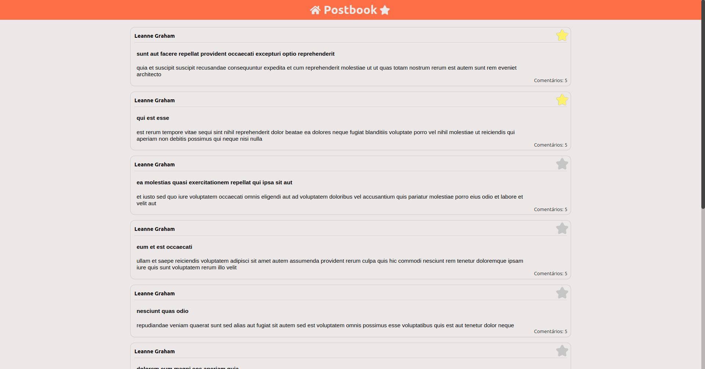
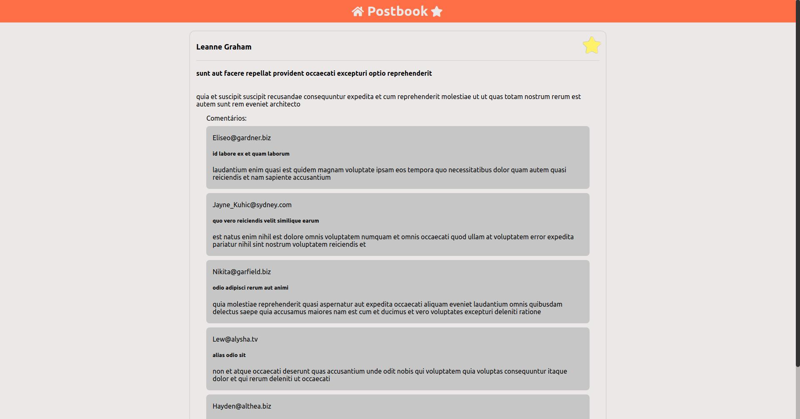
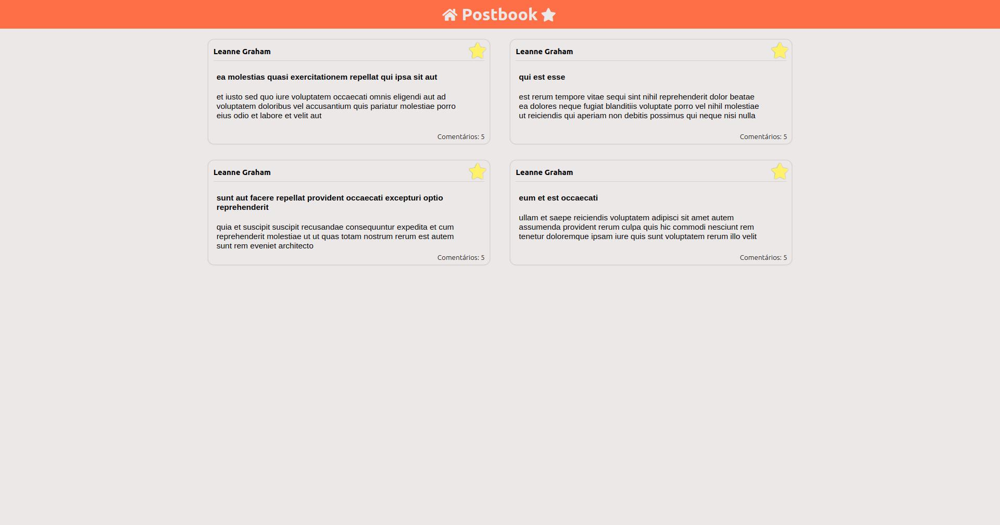
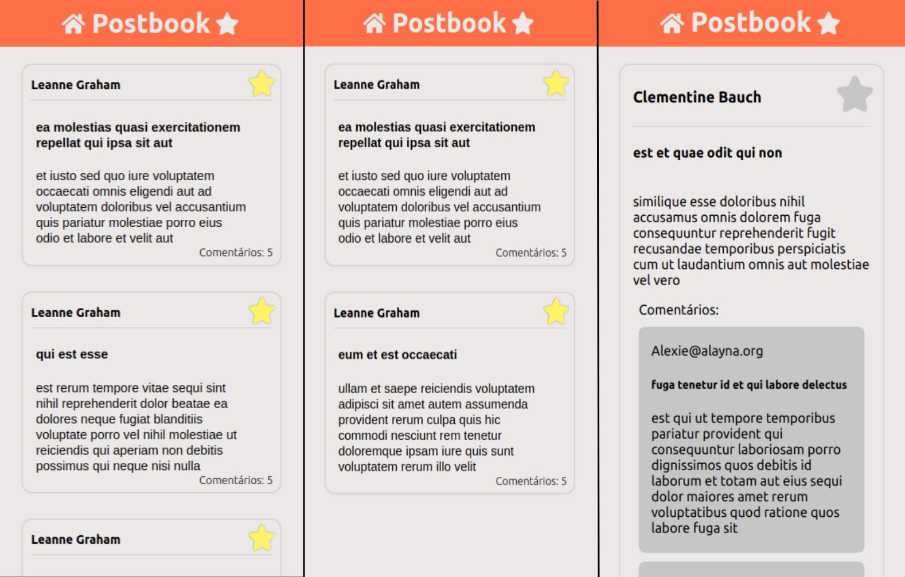

#  Postbook 

An application that displays posts, allowing users to favorite and unfavorite them as needed, also providing access to the details of each post. It includes infinite scrolling if you want to view all the posts.

## Indice
* [Deploy](#deploy)
* [Technologies](#technologies)
* [Installation](#installation)
* [Getting Started](#getting-started)
* [Functionalities](#functionalities)
  * [Main Screen](#main-screen-posts)
  * [Details](#Details--postsid)
  * [Favorites](#favorites--postsfavorites)

## Screenshots









## Deploy
<a href=https://rods27.github.io/Postbook/ target="blank">Link to the application test</a>
Alternatively, you can paste https://rods27.github.io/Postbook/ into your browser.

## Technologies
<ul>
  <li>Javascript</li>
  <li><a href="https://reactjs.org">React</a></li>
  <li>Redux</li>
  <li><a href="https://styled-components.com/">Styled Components</a></li>
</ul>

## Installation
Once you've cloned the repository, using either the vscode terminal or your operating system's terminal:

-Install dependencies using:

```
npm install
```
Run this command in the root folder.

## Getting Started
To make the application work, simply type ```npm start``` in your terminal from the root folder.


## Functionalities
[Back](#indice)
#### Main Screen ```/posts``` 
 <ul>
   <li>Users can read posts and favorite them by clicking the star-shaped button, and unfavorite them as well.</li>
   <li>If the user clicks on a post, they will be directed to the post detail screen.</li>
   <li>If the user reaches the end of the page by scrolling, more posts will be loaded.</li>
   Header:
   <ul>
     Home Button:
     <li>Will redirect to the Main Screen.</li>
     Star Button:
     <li>Will redirect to the favorites.</li>
   </ul>
 </ul><br>

 #### Details  ```/posts/id```
 <ul>
   <li>In this part of the screen, the post detail will be displayed, including comments.</li>
   <li>Users can favorite and unfavorite the post.</li>
 </ul><br>
  
 #### Favorites  ```/posts/favorites```
 <ul>
   <li>In this part of the screen, the user's favorite posts will be displayed.</li>
   <li>Users can access the post detail by clicking on it.</li>
   <li>Users can unfavorite the post.</li>
 </ul><br>
  
 [Back](#indice)
## Feedback 

I would greatly appreciate it if you could provide me with constructive feedback. If you'd like to get in touch, my contact information is provided below!

Email: rods.leite27@gmail.com or <a href="https://linkedin.com/in/rodrigoleite27">Linkedin</a>.
